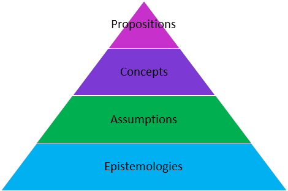

## What is a theory?

Theories are explanations of a natural or social behaviour, event or phenomenon.  
A scientific theory is a system (based on existing **epistemologies**) of constructs (**concepts**) and **propositions** (relationships between the constructs) that collectively presents a logical, systematic and coherent explanation of a phenomenon of interest within some **assumptions** and boundary conditions.

Theories offer a strategy to describe, interpret and/or explain a phenomenon, as well as help explain why people do what they do in certain situations

**Epistomologies**: The overall frame of reference that a theorist brings to the study of families. These understandings also outline methods, validity, and scope of knowledge as well as the distinction between justified belief and opinion.

  - *Positivist Epistemology*: posits that there is a single objective truth about families that can be found through systematic research.
  - *Interpretive Epistemology*: posits that there is no single objective truth, but that experiences are relative to a family.
  - *Critical Epistemology*: what counts as knowledge is determined by those in power.

**Assumptions**: the taken-for-granted ideas that scholars believe to be true about families and lay the groundwork for theory building. Each theory has its own set of assumptions.

**Concepts**: Terms and definitions used to explain the theory's framework based on assumptions. Concepts are integral to explaining theories - they provide the building blocks used to create the theory.

**Propositions**: Statements used to apply a theory and test its ongoing validity.

### Exercises

Characteristics of health promoting families include:

- family stability and positive mother and father relationships,
- holding shared values
- having healthy intra-family relationships and communication, and 
- encouraging healthy behaviours.

In terms of the first theme, most models show ecological or environmental factors to be central components. Secondly, most models recognise cultural and other diversities, in order to be broad enough to accommodate different family types and changes in norms and roles within everyday family life. Lastly, children are often portrayed in models as being more passive recipients of health rather than actively contributing to their own health within the family setting.

